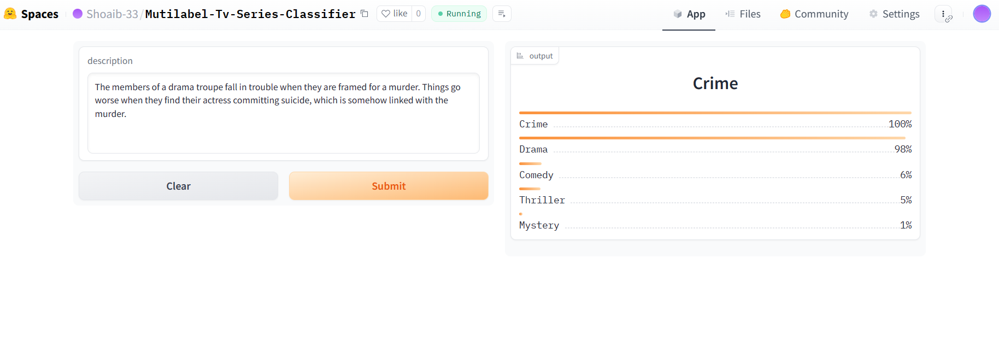
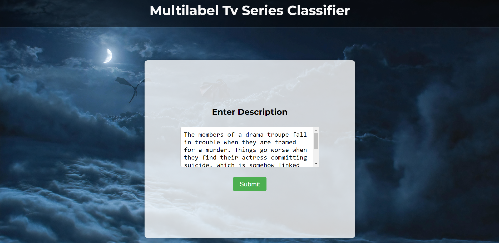
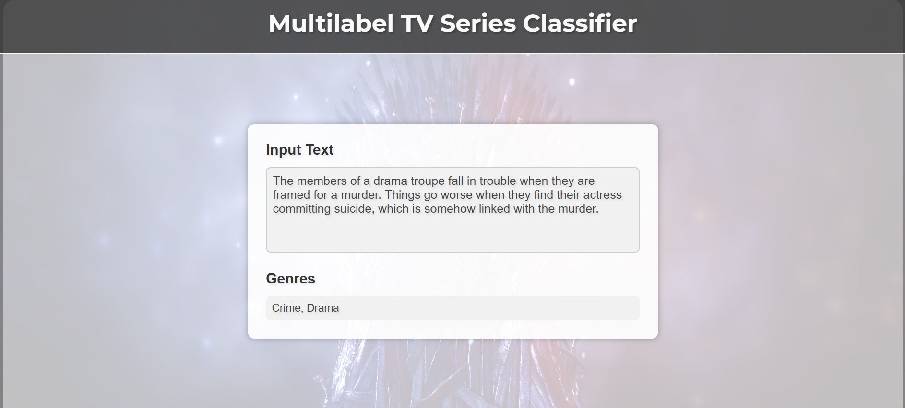

# Multilabel-TV-Series-Classifier

This project is all about text classification which classifies genres of TV series based on the short description of the plot.
It can classify upto 28  different genres of TV Series and can predict genres based on a short description of the TV series plot.
The keys of `deployment\genre_types_encoded.json` shows the TV Series genres.

## Data

Srapping TV series data was done from [IMDb](https://www.imdb.com/search/title/?title_type=tv_series) website using Selenium, collecting almost 25000 descriptions having 28 genres. Then preprocessing and encoding was done on the scraped data .The scrapping notebook is available in `Scrapper/tv_series_scrap.py`

**Dataset is avalable [here](https://github.com/Shoaib-33/Multilabel-TV-Series-Classifier/tree/main/Data)**.It is also available in `Data/Tv_Series_Data.csv`

## Model

In my project, I fine-tuned a pre-trained DistilRoberta-Base model using HuggingFace Transformers alongside Fastai and Blurr. Through rigorous training, I obtained remarkable results, achieving an outstanding accuracy of 99.885% and an impressive F1 score (micro) of 99.98%. To optimize the model for deployment, I converted it to the ONNX format and further compressed it using ONNX quantized format. You can find the detailed model training notebook for reference [here](https://github.com/Shoaib-33/Multilabel-TV-Series-Classifier/tree/main/Notebooks). All the models are available in `Models`

## Model Compression and ONNX Inference
The trained model has a memory of 300+MB. I compressed this model using ONNX quantization and brought it under 80MB.The compressed notebook of ONNX is available in `Deployment/Tv_Series-classifier-quantized.onnx`

## Model Deployment

I deployed the compressed model on HuggingFace Spaces using a Gradio App. The implementation is available in the deployment folder. You can explore the live demo by visiting[here](https://huggingface.co/spaces/Shoaib-33/Mutilabel-Tv-Series-Classifier). The deployment notebooks and app are available in `Deployment`

  

## Web Deployment
In addition to the Gradio App deployment on HuggingFace Spaces, I also created a Flask web application using the space api.This Flask web app takes a movie description as input and predicts the most suitable multilabel genre based on the given description. You can find the relevant code in the 'Flask' branch. The web application is now live and can be accessed[here](https://multilabel-tv-series-classifier-drg6.onrender.com/).The resources related to Web Deployment is avalable in `Server`

<table>
  <tr>
    <td>
      
    </td>
    <td>
      
    </td>
  </tr>
</table>

